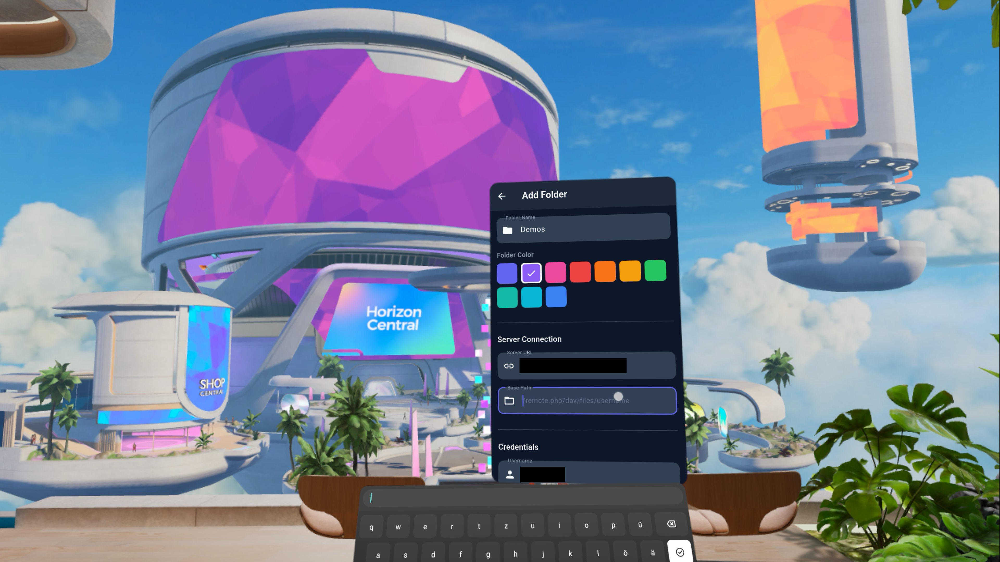
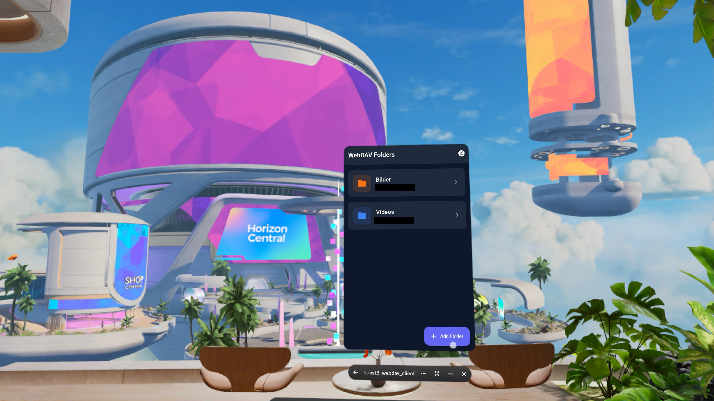

# Quest3 WebDAV Client

A WebDAV client application optimized for Meta Quest 3 VR headset. Browse your cloud storage (Nextcloud, ownCloud, or any WebDAV server), stream media, and download files for offline viewing - all in an immersive VR environment.

[▶ Demo Video](assets/demo.mp4)

<p align="center">
  
  
</p>

## Features

- **Virtual Folders**: Create multiple connections to different WebDAV servers or paths
- **Secure Credentials**: Passwords stored using platform-native encryption (Android EncryptedSharedPreferences)
- **File Browser**: Navigate directories with grid or list view
- **Media Streaming**: Stream images and videos directly from your server
- **Offline Mode**: Download files for offline viewing
- **VR Optimized**: UI designed for Quest 3 display (2064x2208 per eye, 90Hz)
- **360/VR Video**: Support for panoramic and VR video content
- **Image Viewer**: Fullscreen viewing with pinch-to-zoom and pan

## Requirements

- Meta Quest 3 headset with Developer Mode enabled
- Flutter SDK 3.10.7 or higher
- Android SDK with API level 26+ support
- A WebDAV server (Nextcloud, ownCloud, etc.)

## Installation

### Development Setup

1. **Install Flutter**

   ```bash
   # Follow instructions at https://docs.flutter.dev/get-started/install
   flutter doctor
   ```

2. **Clone the repository**

   ```bash
   git clone <repository-url>
   cd quest3_webdav_client
   ```

3. **Install dependencies**

   ```bash
   flutter pub get
   ```

4. **Generate database code**

   ```bash
   dart run build_runner build
   ```

5. **Run on emulator or device**
   ```bash
   flutter run
   ```

### Building for Quest 3

1. **Build debug APK**

   ```bash
   flutter build apk --debug
   ```

   The APK will be at `build/app/outputs/flutter-apk/app-debug.apk`

2. **Enable Developer Mode on Quest 3**

   - Go to Settings > System > Developer
   - Enable Developer Mode (requires Meta developer account)

3. **Install via ADB**

   ```bash
   # Connect Quest 3 via USB and authorize the connection
   adb devices
   adb install build/app/outputs/flutter-apk/app-debug.apk
   ```

4. **Find the app**
   - In Quest 3, go to App Library
   - Select "Unknown Sources" from the dropdown
   - Launch "Quest3 WebDAV"

## Usage

### Creating a Virtual Folder

1. Launch the app and tap the **+** button
2. Enter a name for your folder (e.g., "My Nextcloud")
3. Enter the server URL (e.g., `https://cloud.example.com`)
4. Enter the base path (e.g., `/remote.php/dav/files/username`)
5. Enter your username and password
6. Tap **Test Connection** to verify
7. Save when the connection is successful

### Browsing Files

- Tap a virtual folder to open it
- Navigate directories by tapping folders
- Use breadcrumb navigation at the top to jump to parent directories
- Pull down to refresh the current directory
- Toggle between grid and list view with the view mode button

### Viewing Media

- **Images**: Tap to open fullscreen, pinch to zoom, swipe to navigate
- **Videos**: Tap to play with streaming, use controls overlay
- **360/VR Content**: Automatically detected from filename patterns (360, vr, spherical)

### Offline Files

- Tap the download button on any media file to save offline
- Access offline files from the home screen menu
- Swipe to delete individual offline files
- Use "Clear All" to remove all offline content

## Project Structure

```
lib/
├── app.dart                 # Main app configuration
├── main.dart                # Entry point
├── constants/
│   └── app_theme.dart       # Theme and styling
├── database/
│   └── database.dart        # Drift database setup
├── dialogs/
│   ├── delete_folder_dialog.dart
│   └── template_selection_dialog.dart
├── models/
│   ├── file_item.dart       # File/directory model
│   ├── offline_file.dart    # Offline file tracking
│   ├── server_credentials.dart
│   ├── virtual_folder.dart  # Virtual folder model
│   └── webdav_exception.dart
├── providers/
│   ├── credential_provider.dart
│   ├── database_provider.dart
│   ├── file_browser_provider.dart
│   ├── media_viewer_provider.dart
│   ├── offline_files_provider.dart
│   ├── providers.dart       # Barrel export
│   └── virtual_folder_provider.dart
├── screens/
│   ├── file_browser_screen.dart
│   ├── home_screen.dart
│   ├── image_viewer_screen.dart
│   ├── offline_files_screen.dart
│   ├── video_player_screen.dart
│   ├── virtual_folder_form_screen.dart
│   └── vr_video_player_screen.dart
├── services/
│   ├── credential_service.dart
│   ├── download_service.dart
│   ├── image_cache_service.dart
│   ├── media_type_detector.dart
│   ├── offline_file_service.dart
│   └── webdav_service.dart
├── utils/
│   ├── mime_type_helper.dart
│   └── quest3_display_helper.dart
└── widgets/
    ├── breadcrumb_navigation.dart
    ├── connection_status_indicator.dart
    ├── download_button.dart
    ├── download_progress_indicator.dart
    ├── empty_directory.dart
    ├── file_grid_item.dart
    ├── file_list_item.dart
    ├── folder_card.dart
    ├── image_viewer_overlay.dart
    ├── video_controls_overlay.dart
    ├── video_progress_bar.dart
    └── viewer_mode_selector.dart
```

## Dependencies

| Package                | Version | Purpose                        |
| ---------------------- | ------- | ------------------------------ |
| webdav_client          | ^1.2.2  | WebDAV protocol implementation |
| dio                    | ^5.9.0  | HTTP client for WebDAV         |
| flutter_secure_storage | ^9.2.4  | Encrypted credential storage   |
| drift                  | ^2.27.0 | Type-safe SQLite database      |
| sqlite3_flutter_libs   | ^0.5.32 | SQLite native libraries        |
| flutter_riverpod       | ^2.6.1  | State management               |
| video_player           | ^2.9.5  | Video playback                 |
| vr_player              | ^0.3.0  | 360/VR video support           |
| photo_view             | ^0.15.0 | Image viewing with zoom        |
| flutter_cache_manager  | ^3.4.1  | File caching                   |
| path_provider          | ^2.1.5  | File system paths              |
| path                   | ^1.9.0  | Path manipulation              |
| uuid                   | ^4.5.1  | UUID generation                |

### Dev Dependencies

| Package       | Version | Purpose                  |
| ------------- | ------- | ------------------------ |
| flutter_test  | SDK     | Testing framework        |
| flutter_lints | ^6.0.0  | Linting rules            |
| drift_dev     | ^2.27.0 | Database code generation |
| build_runner  | ^2.4.15 | Code generation          |

## Quest 3 Considerations

- **Display**: 2064x2208 pixels per eye at 90Hz (up to 120Hz)
- **Field of View**: 110° horizontal, 96° vertical
- **Android API**: Level 26 (Android 8.0 Oreo)
- **UI Design**: Large touch targets, high contrast, readable text at VR distances
- **Performance**: Optimized for 2D panel rendering in VR environment

## Testing

Run all tests:

```bash
flutter test
```

Run specific test file:

```bash
flutter test test/services/credential_service_test.dart
```

## Code Quality

Run static analysis:

```bash
flutter analyze
```

Apply automatic fixes:

```bash
dart fix --apply
```

## License

This project is licensed under the GNU Affero General Public License v3.0 (AGPL-3.0).

See [LICENSE](LICENSE) for the full license text.

## Author

Marcel Joachim Kloubert <marcel@kloubert.dev>

## Contributing

Contributions are welcome! Please ensure:

1. All source files include the AGPL license header
2. Code passes `flutter analyze` without issues
3. New features include appropriate tests
4. Documentation is updated for any API changes
